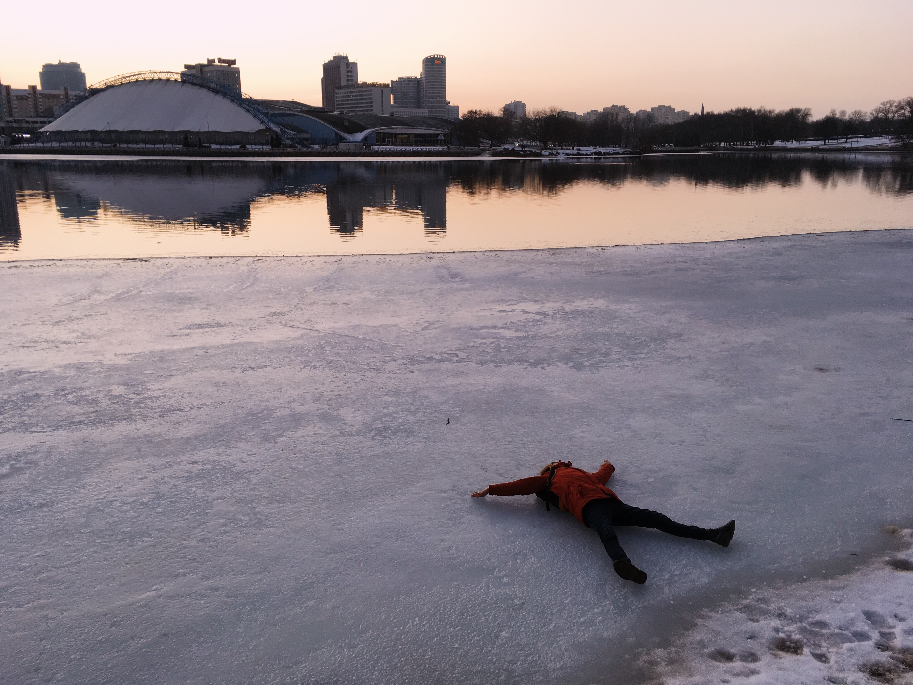

# Raman Prudnikau 

---
### rs-school student 
### Contact information:
#### Phone: +48516454148 
#### E-mail: ramanprudnikau@gmail.com
#### Discord: Raman_Pr(@RamanPr5)
#### GitHub: [RamanPr5](https://github.com/RamanPr5)

---
### Education:
* Vitebsk State Medical University (2011-2016)
* Pharmaceutical faculty
* Pharmacist (Provisor)
  
---
### Work experience
* Pharmacy manager, Pharmacy, Mogilev (2019-2022)
* Pharmacist, Pharmacy, Gorki (2016-2019)
 
---
### Skills:
* HTML5
* CSS3
* Git, GitHub
* VS Code
  
---
### Code example

```
const isPalindrome = (word) => {
  const lowerWord = word.toLowerCase();
  return lowerWord === reverse(lowerWord);
};

const isNotPalindrome = (word) => !isPalindrome(word);

```
---
### Courses
* RS Schools Course «JavaScript/Front-end 2023Q1» (in progress)
  
---
### Languages: 
* Russian: Native
* Belarussian: Native
* English: A1 (Elementary)


