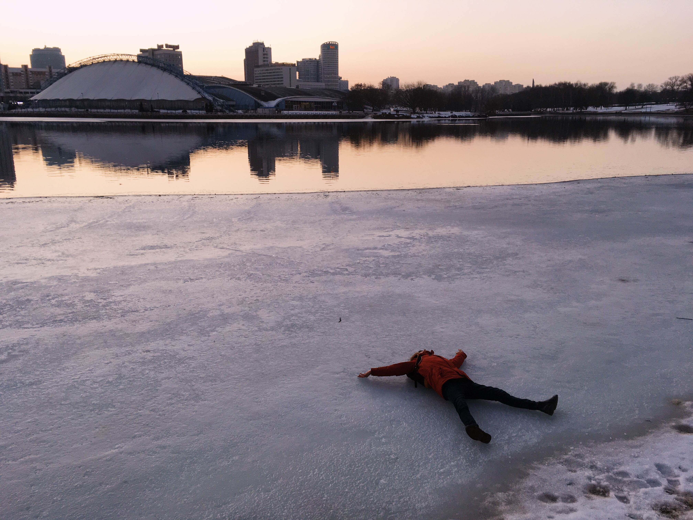

# Raman Prudnikau 
<!--  -->
---
### rs-school student 
---
### Contact information:
#### Phone: +48516454148 
#### E-mail: ramanprudnikau@gmail.com
#### Discord: Raman_Pr(@RamanPr5)
#### GitHub: [RamanPr5](https://github.com/RamanPr5)

---
### About me:
Former pharmacist transitioning into frontend development. Actively learning modern technologies for building user interfaces, including HTML, CSS, and JavaScript. Eager to apply analytical skills and attention to detail, honed in healthcare, to create intuitive and functional web applications.

---
### Education:
* Vitebsk State Medical University (2011-2016)
* Pharmaceutical faculty
* Pharmacist (Provisor)
  
---
### Work experience
* Pharmacy manager, Pharmacy, Mogilev (2019-2022)
* Pharmacist, Pharmacy, Gorki (2016-2019)
 
---
### Skills:
* HTML5
* CSS3
* JavaScript (Fundamentals, DOM, Data types)
* Git, GitHub
* VS Code

  
---
### Code example

```
const isPalindrome = (word) => {
  const lowerWord = word.toLowerCase();
  return lowerWord === reverse(lowerWord);
};

const isNotPalindrome = (word) => !isPalindrome(word);

```
---
### Courses
* RS School JS/FE Pre-School 2024Q2 [Certificate](https://app.rs.school/certificate/lizte7iq)
* RS School Course «JavaScript/Front-end 2024Q4» (in progress)
  
---
### Languages: 
* Russian: Native
* Belarussian: Native
* English: A2 (Pre-intermediate)
* Polish (Basic)

---
### Location:
 Bialystok,  Poland


